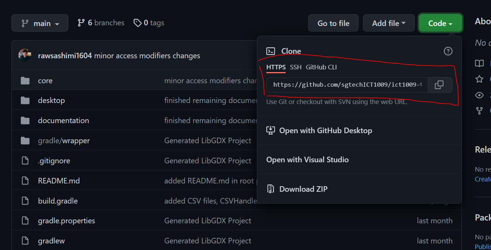
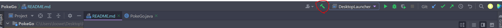
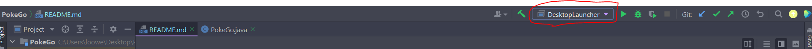
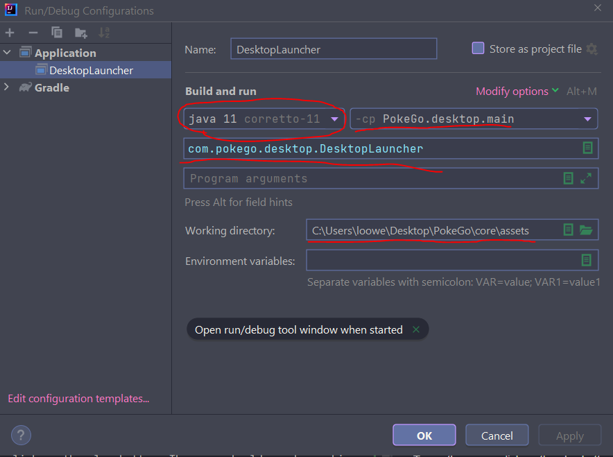
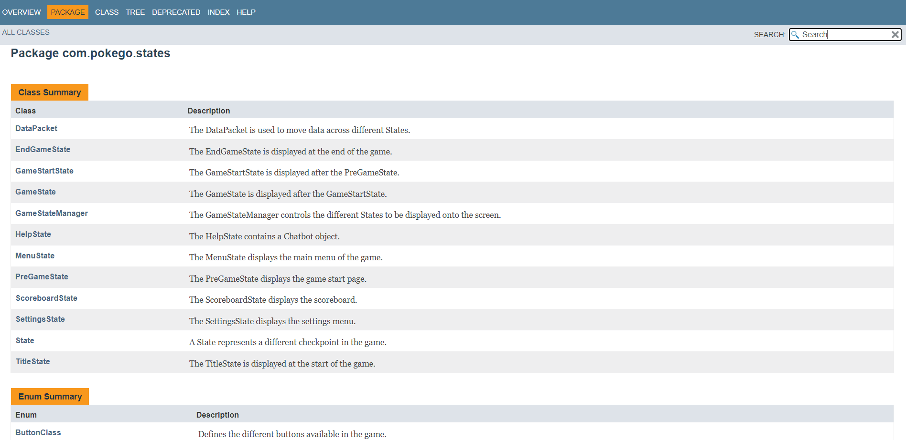

# PokeGo - An ICT1009 Java Project

## Information
A Java project done by Team 41 for the module **ICT 1009 (Object-Oriented Programming)**.

PokeGo is a local 2-player game built using the open source LibGDX engine.

## Team Members
- GAVIN LOO WEI REN
- CASTRO JERIEL PEDROCHE
- LEONG SHU MIN
- MATHUKUMILLI GEETHIKA
- LEONG WAI KIAT
- NYAN LIN HTOO

## Code Structure
- Game source code can be found in `./core/src/com/pokego/`
- Game assets can be found in `./core/assets`
- Desktop application can be found in `./desktop/src/com/pokego/desktop`

## Installation
The game is primarily coded in Intellij IDE. First, install the IDE to your machine.

Then, copy the link to the repository here.

From there open up command prompt, and navigate to the directory you would like to store the game.

Use this command to clone the repo.
`git clone https://github.com/sgtechICT1009/ict1009-team41-2022.git`

Then, open the project with IntelliJ IDE.

First build the project. 

After the build is finished, click here and edit configuration. Create a new application configuration. Java version should be **Java 11** for the game to work correctly.

Make sure to set working directory to `./core/assets`, run the `main()` function in `DesktopLauncher` class to start the game.

To run the game, click on the play button. The game should now be working and launched in a separate window.

## Documentation

To view documentation, go to the `./documentation/index.html` file. Use any browser to open the `.html` file. 